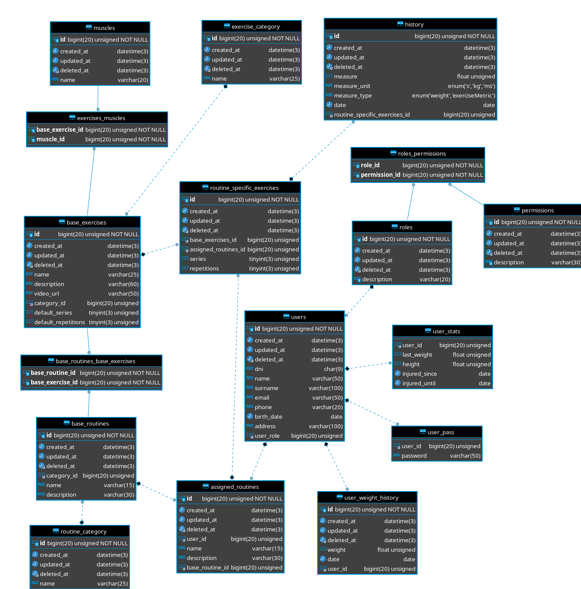

# YouLift Back End
<!-- TOC depthFrom:2 orderedList:false -->

- [ER Diagram](#er-diagram)
- [API definition](#api-definition)
    - [**How it read this documentation**](#how-it-read-this-documentation)
    - [**V1**](#v1)
        - [**User**](#user)
        - [**Assigned routine**](#assigned-routine)
        - [**Routine Specific Exercises**](#routine-specific-exercises)
        - [**Permissions**](#permissions)
        - [**Roles**](#roles)
        - [**Base exercises**](#base-exercises)
        - [**Base Routines**](#base-routines)
        - [**Routine Category**](#routine-category)
        - [**Exercise Category**](#exercise-category)
        - [**Muscle**](#muscle)
        - [**Special calls**](#special-calls)
        - [**Reset password**](#reset-password)
        - [**User stats**](#user-stats)
        - [**Get user weight history**](#get-user-weight-history)
        - [**Add user weight history point**](#add-user-weight-history-point)
        - [**Exercise history**](#exercise-history)

<!-- /TOC -->
## ER Diagram



## API definition
### **How it read this documentation**
Every element (or CRUD) follows the same principles:

+ Has 5 routes
+ The "get one" and "delete" routes are followed by the id of the element to get/delete

This is an example with the "users" element:

**Users**

Route: user/

Request body:

```JSON
{
  "DNI": String,
  "Name": String,
  "Surname": String,
  "Email": String,
  "Phone": String,
  "BirthDate": String,
  "Address": String,
  "UserRole": Int
}
```

<input type="checkbox" checked> Filtered

This means that the "user" calls are as follows:

+ Create (POST): user/
+ Get one (GET): user/:id
+ Get filtered (GET): user/
+ Update (PUT): user/
+ Delete (DELETE): user/:id

Also, the create, update and get filtered need a request body as specified.

The filtering of the "Get filtered" call can be done with any of the fields of the request body, for example, we would filter users with the admin role performing a GET request to user/ with this request body:

```JSON
{
  "UserRole": 1
}
```

The filtering is only available on calls wich have a filtering tick mark like this one: <input type="checkbox" checked> Filtered

<br><br><br>

### **V1**

Every url defined in the V1 version prepends ```/v1/```

#### **User**

Route: ```user/```

Request body:

```JSON
{
  "DNI": String,
  "Name": String,
  "Surname": String,
  "Email": String,
  "Phone": String,
  "BirthDate": String,
  "Address": String,
  "UserRole": Int
}
```

<input type="checkbox" checked> Filtered

#### **Assigned routine**

Route: ```assignedRoutine/```

Request body:

```JSON
{
  "UserID": Int,
  "Name": String,
  "Description": String,
  "BaseRoutineID": Int
}
```

<input type="checkbox" checked> Filtered

#### **Routine Specific Exercises**

Route: ```routineSpecificExercises/```

Request body:

```JSON
{ 
  "BaseExercisesID": Int,
  "AssignedRoutinesID": Int,
  "Series": Int,
  "Repetitions": Int
}
```

The create method requires only the "BaseExercisesID" and "AssignedRoutinesID" fields.

<input type="checkbox" checked> Filtered

#### **Permissions**

Route: ```permission/```

Request body:
```JSON
{ 
    "Description": String
}
```

<input type="checkbox" checked> Filtered

#### **Roles**

Route: ```role/```

Request body:

```JSON
{ 
    "Description": String,
    "Permissions": []Permissions
}
```

<input type="checkbox" checked> Filtered

#### **Base exercises**

Route: ```baseExercise/```

Request body:

```JSON
{
  "Name": String,
  "Description": String,
  "VideoURL": String,
  "CategoryID": Int,
  "DefaultSeries": Int,
  "DefaultRepetitions": Int,
  "Muscles": []Muscle
}
```

<input type="checkbox" checked> Filtered

#### **Base Routines**

Route: ```baseRoutine/```

Request body:

```JSON
{
  "CategoryID": Int,
  "Name": String,
  "Description": String,
  "BaseExercises": []BaseExercise
}
```

<input type="checkbox" checked> Filtered

#### **Routine Category**

Route: ```routineCategory/```

Request body:

```JSON
{
    "Name": String
}
```

#### **Exercise Category**

Route: ```exerciseCategory/```

Request body:

```JSON
{
    "Name": String
}
```

#### **Muscle**

Route: ```muscle/```

Request body:

```JSON
{
    "Name": String
}
```

#### **Special calls**

These calls do not have the basic CRUD functionality, instead these are for geting specific data or performing various specific tasks.

#### **Reset password**

Route: ```resetPassword/:userId```
route method: GET

Request body: none

#### **User stats**

This element only has two calls, one for getting the user stats and other for updating them (GET & PUT).

Route: ```userStat/:userId```

Request body: none


#### **Get user weight history**

This call gets a paged lsit of the user's weight history.

Route: ```userWeight/:userId```

Request body: 
```JSON
{
	"Size": Int,
	"Offset": Int
}	
```

Return body:

```JSON
[
  {
    "ID": Int,
    "Weight": Float,
    "Date": String,
    "UserID": Int
  }
  ...
]
```
#### **Add user weight history point**

This call adds a new weight history point to the specified user.

Route: ```userWeight/:userId```

Request body:
```JSON
  {
    "Weight": Float,
    "Date": String,
    "UserID": Int
  }
```

#### **Exercise history**

This two calls create and return the exercises history of a specific user (GET & POST).

Route ```history/:userId```

Request body:

```JSON
{
  "Measure": float,
  "MeasureUnit": String 's' | 'kg' | 'ms',
  "MeasureType": String 'weight' | 'exerciseMetric',
  "Date": String,
  "RoutineSpecificExercisesID": Int
}
```